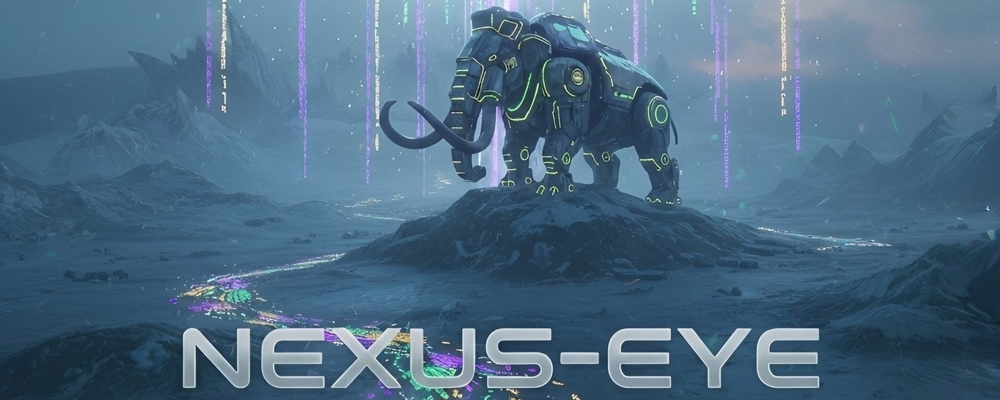

# Nexus-Eye 🦣👁️

**Industrial-grade syntax highlighting for Angular inline templates on GitHub.**

Nexus-Eye is a Chrome extension designed to bring IDE-level visual clarity to GitHub Pull Requests. It solves the "White Text Problem" by identifying Angular template regions inside TypeScript files and applying a high-contrast, professional theme instantly.

## 🚀 Key Features

- **Modern Control Flow**: Full support for Angular v17+ structural blocks (`@if`, `@for`, `@switch`, `@defer`, etc.).
- **Signal Aware**: Highlighting for `signal()`, `computed()`, and interpolation `{{ }}`.
- **Surgical Precision**: Isolated strictly to `template: \`` blocks—your TypeScript logic and metadata remain untouched.
- **Interactive Toggle**: Enable/disable highlighting instantly via the extension icon.

## 📦 Installation

### From Chrome Web Store (Recommended)
*Coming Soon!*

### Developer Mode (Manual)
1. Download this repository as a ZIP and extract it.
2. Open Chrome and navigate to `chrome://extensions`.
3. Enable **Developer mode** (top right).
4. Click **Load unpacked** and select the extracted folder.

## 🏗️ Technical Architecture

Nexus-Eye uses a **Sequential Sentinel** engine to track Angular template boundaries across GitHub's virtualized DOM.

### Key Concepts:
- **Dynamic Boundary Checking**: State is reset automatically when scrolling between different file containers in a PR.
- **Surgical Mutation Observation**: Uses a `MutationObserver` to detect and highlight new lines instantly as GitHub's React engine renders them.
- **Stateful Persistence**: Tracks template entry/exit points for every line to maintain highlighting accuracy during virtual scroll cycles.

For a deep dive into the trade-offs between local parsing and raw file fetching, see the official [Architecture Guide](https://github.com/TundraCube/tundra-nexus/blob/master/glacial-vault/src/content/knowledge/projects/tundra-nexus/nexus-eye-architecture.md).

## 🛠️ Built with
- Vanilla JavaScript
- Surgical CSS
- Pure state-machine logic
- PrismJS (High-Contrast Theme)

## 🔒 Privacy
Nexus-Eye is 100% private. It runs entirely on your local machine. No data collection, no tracking. No background network requests are made to GitHub's raw file servers.

---
Part of the [Tundra Nexus](https://github.com/TundraCube/tundra-nexus) ecosystem.
